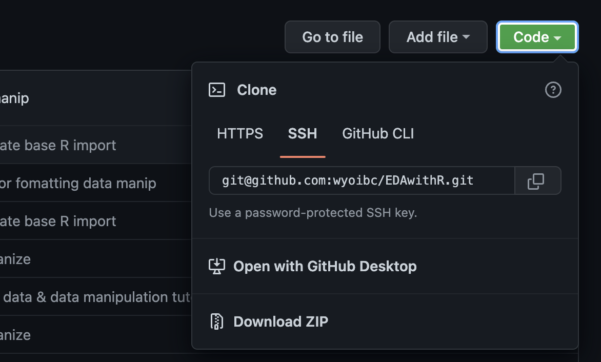
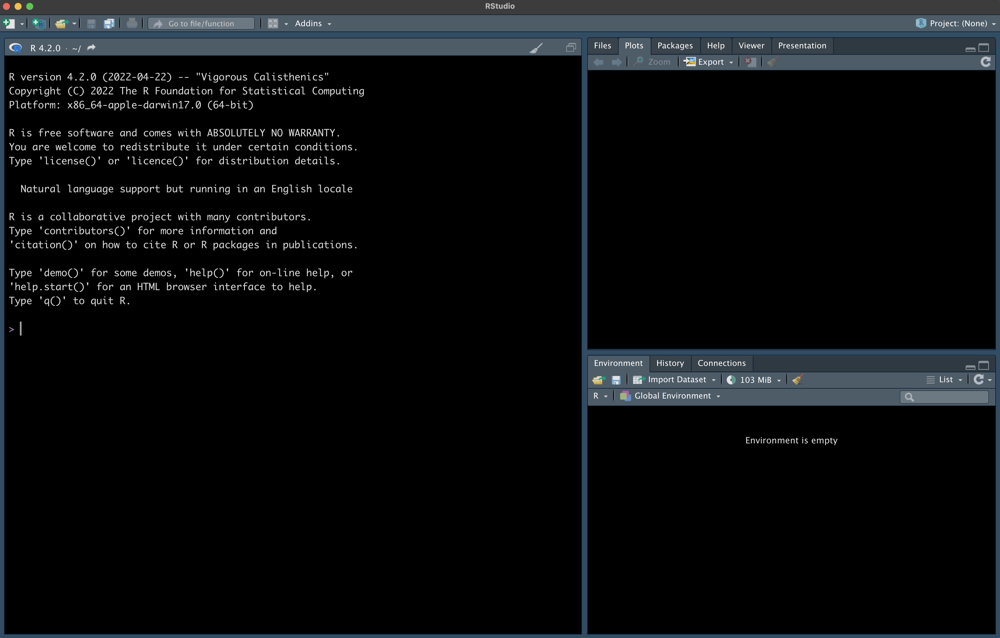

```{r setup, include=FALSE}
knitr::opts_chunk$set(echo = TRUE)
knitr::opts_knit$set(root.dir = '~/EDAwithR/001_Importing_Data/tidyverse/data/')

```

<br>

We'll start with a quick demonstration of how to read data into R using base R functions. These are functions that are part of R's basic install, which means that you do not have to load up any special packages to use them. We'll just look at a few of the most common functions. In the next sections we'll look at Tidyverse functions that work in similar ways, but with some added functionality.

<br>

Before we start actually working with the data, there are a few basic setup things to handle:

<br>

## Downloading the data

Before we can work with the data, we need to download it. Go to the Github repository for this workshop: https://github.com/wyoibc/EDAwithR and click on the green `Code` button, then on the `Download ZIP` button. (You can alternately clone the repo if you're familiar with git).

{#id .class width=50% height=50%}\

<br>

This will download a copy of the repository, including all data necessary to work through tutorials. You will need to extract the ZIP file.


<br>

## Basic orientation in RStudio

When you first open RStudio, it will look something like this, although with different colors and the panes on the right may be arranged differently for you; I have changed some options in my install of RStudio:

{#id .class width=70% height=70%}\

<br>

On the left is the console. You can type R commands directly into this window and hit `return` to execute them. On the right are two useful panes that show you things like what objects are loaded in your environment (i.e., what data and functions are currently loaded in R), a file browser, a window for plots that R makes, etc. We won't go over all of these here.

<br>

## Starting an R script

While you *could* type all of your code directly into the console in RStudio, I **HIGHLY** recommend that you put all of your code into a script whenver you code in R (and any other languages). A script is just a text file that contains commands for R (or another language). When you put all of your commands into an R script and save it, you keep a permanent record of what you did. This helps you remember what you did; lets you replicate what you did or slightly tweak what you did if you need to redo it, make small changes, or run the same operations on a different dataset; and allows you to share your code with others so that others can replicate your science.

If you haven't done much coding before, you'll be surprised just how fast you can forget everything you did, and even more importantly, why you did it. Well commented scripts avoid (or at least massively mitigate) this problem.

To open a new R script, click on the little `+` button in the top right of RStudio and click on `R script`:

{#id .class width=45% height=45%}\

<br>

This will open a new window with an empty R script. You can type all of your code into here. Once you type a line of code, you can run it by hitting `command + return` if you are on a Mac or `ctrl + return` if you are on Windows while your cursor is anywhere in that line. You can also highlight entire blocks of code or portions of a single line and run the selected code the exact same way.

To save your R script, go up to `file` in the menu bar (possibly at the top of your screen, above your RStudio window) and select `save as`.

In your script, anything that you type after `#` will be treated as a comment, meaning that R will not try to run it. This allows you to include information about what you're running and why as a reference for your future self and anyone that you might share the code with. For an idea of how I structure R scripts and use comments, take a look here: https://github.com/seanharrington256/Lgetula_gbs/blob/master/04_R_analyses/Lgetula_pop_assignment.R   

This is a single script from the Github repository for a manuscript I authored on kingsnake population genetics. This script does a lot of things in a large loop over multiple datasets, and would be pretty hard to figure out without lots of comments. Readability is particularly important here because this is publicly available code that accompanies the manuscript so that others can replicate my analyses if they choose.


<br>

### Set the working directory

The first step in reading in data is always just making sure that R knows where to look for your data files. You can do this in two ways. One is to specify the full file path to where your data are located when read them in, and the other is to set the working diretory to where your data are and then read them in just using the file names from within that directory.  

We'll use the latter strategy for ease. Set the working directory. 

```{r}
setwd("~/EDAwithR/001_Importing_Data/tidyverse/data/")
```


Note that your path may differ from mine depending on where you put the data and depending on what operating system you are using. If you are not sure what the path is to the data directory, you can use one of 2 point and click options: 1) Use "Files" tab in one of the main panes in R studio to navigate to the directory you want to set as your working directory,

{#id .class width=45% height=45%}\

then click on the gear for "More" at the top of this pane, and click "Set as working directory"

{#id .class width=45% height=45%}\

or 2) up at the very top, by "File", "Edit", etc., you can click `Session`, go to `Set working directory` and click `Choose working directory` this will open a file browser and let you navigate to the directory you want to select.


{#id .class width=45% height=45%}\

Either of these options will execute a line of code in your console that sets the working directory. Copy that line and paste it into your script. Once you've done that, you can just execute that line any time you open your script instead of navigating through directories by pointing and clicking.


<br>

We can check that this worked with `getwd()` and then list out the files to make sure we have what we should:

```{r}
getwd()
list.files()
```

Cool, that looks good to me.

<br>

### Reading in a .csv file

`.csv` files are "comma separated value" files, and they are one of the most common ways that data are stored for import into R.

We can easily read these in using `read.csv()` and store the data in an object:

```{r}
states <- read.csv("covid_us-states.csv")
head(states) # look at the top of the data
```


There are a few other arguments in `read.csv()` that you may want to explore depending on your dataset, e.g., in the event that your .csv file does not start with a row of column names but instead immediately starts with your data, you will want to set `header = FALSE`.


<br>


### Reading in a tab delimited file

Tab delimited files are another super common data format for import into R. We can import these using `read.delim`.


```{r}
woodpeckers <- read.delim("Acorn_Woodpecker.txt")
head(woodpeckers)
```

<br>

### Reading in lines of text

You can also read in lines of text from a plain text file without imposing any formatting on the object. I have used this to read in log files and search for specific words or values in the files.

```{r}
woodpeckers_lines <- readLines("Acorn_Woodpecker.txt")
head(woodpeckers_lines)
```


<br>


There are many other functions for reading data into R, including several Tidyverse functions that we'll touch on briefly as well as many others from other packages.


